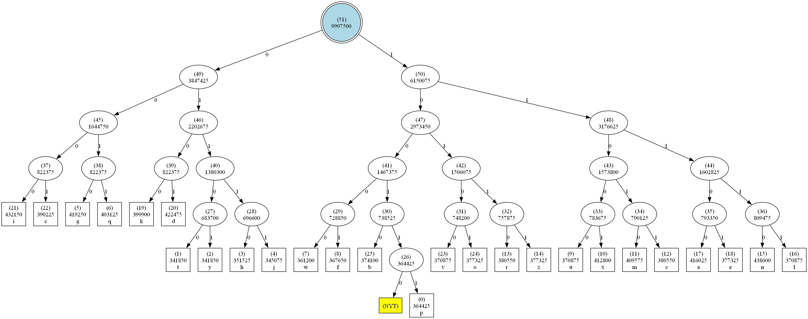

# Adaptive Huffman Coding Implementation

This repository contains a C++ implementation of the Adaptive Huffman Coding algorithm, designed to encode text dynamically based on symbol frequencies as they are processed. The project is divided into two main folders:

1. **Adaptive_Huffman**: The core implementation of the Adaptive Huffman coding algorithm.
2. **Adaptive_Huffman_creating_video**: A variant of the implementation that includes functionality for creating a video to visualize how the Huffman tree changes during the encoding process using Graphviz and FFmpeg. Additionally, this version also generates a final image of the Huffman tree after the encoding process is complete.

## Final Huffman Tree

After the encoding process is complete, a final image of the Huffman tree is generated. Below is an example of what the tree might look like:

## Features

- **Adaptive Huffman Coding**: Dynamically adjusts the Huffman tree as symbols are processed, ensuring efficient encoding.
- **INERATION**: A threshold feature that allows periodic adjustments to the tree. If the number of symbols in the tree exceeds the INERATION value, all node weights are divided by 2. This feature can be disabled by setting the `INERTION` value to 0 in `main.cpp`.
- **Tree Visualization**: The `Adaptive_Huffman_creating_video` folder includes functionality to create a video showing the evolution of the Huffman tree during the encoding process, as well as generating a final image of the tree.

## Prerequisites

- **C++17 Compiler**: Ensure you have a working C++ compiler that supports C++17.
- **Graphviz**: Required for generating visual representations of the Huffman tree.
- **FFmpeg**: Required for creating a video from the tree visualization images.